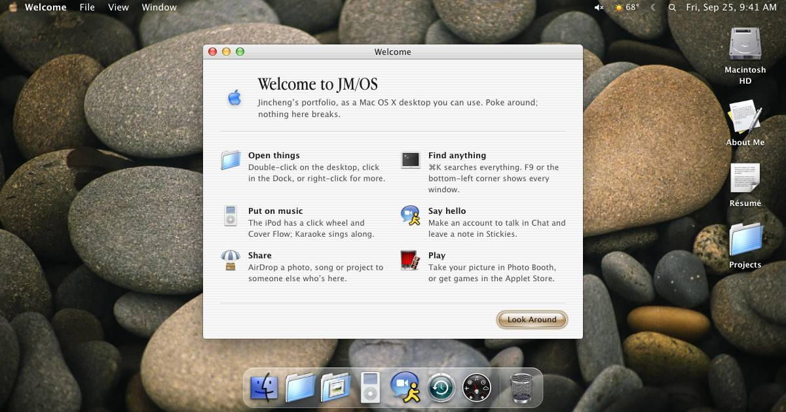

# JM/OS: majincheng.com

**Live at [www.majincheng.com](https://www.majincheng.com).**

[](https://www.majincheng.com)

Jincheng Ma's own place on the web, a Mac OS X Aqua desktop in the
browser: a hideout rather than a portfolio.

Projects, the résumé, photos and posts open as windows on the desktop.
Around them sits a small working system:

- **Shell:** menu bar, Dock, Exposé, Dashboard, Spotlight, a screen saver,
  and Finder over Macintosh HD, with Jincheng's home folder: locked, as
  another user's was, but for Public and Sites. Time Machine goes back
  through the days in space, to the apps, music and discs the desktop
  had then.
- **Apps and applets:** Terminal, TextEdit, iPod (with Jincheng's
  ratings and playlists, and On-The-Go) and Karaoke with synced lyrics,
  DVD Player
  (YouTube videos burned onto discs, kept in Finder's Movies folder),
  Chess, Photo Booth, and applets from the Applet Store (Minesweeper,
  Spider Solitaire, Pinball, Synth and more).
- **Job Hunt:** every company Jincheng has applied to, on a board of
  stages kept up from Gmail; everyone else sees only the numbers.
- **Social:** member accounts, Chat with rooms and private conversations,
  a Stickies guestbook and, for every member, stickies on their own
  desktop and an iCal of their own,
  AirDrop between visitors, and Soapbox posts sent from a Telegram bot.
- **Ambient:** the desktop follows the light and weather where the visitor
  is.

The page also ships a plain-text copy of everything for screen readers,
search engines and browsers without JavaScript. Every project has its own
page at `/projects/<slug>/`.

## Stack

- [Astro](https://astro.build) 7, static output, with one client-only
  React 19 island for the desktop (`src/os/`), plus zustand and motion.
  Node 24: `engines` in `package.json`, which Vercel and CI follow; use
  the same locally (npm warns about another major).
- [Supabase](https://supabase.com): accounts, Postgres with row-level
  security, Realtime, Storage and Edge Functions (Deno).
- [Vercel](https://vercel.com): hosting and four small functions in
  `api/` (the visitor's location, a lyrics relay, the music library,
  cached at the edge, and whether a page can be framed in the Browser).
- Vitest, Playwright for preview images, and GitHub Actions.

## Running it

```bash
npm install
npm run dev        # http://localhost:4321
npm test           # unit tests (Vitest)
npm run test:db    # database rules against a local Postgres (needs psql)
npm run build      # -> dist/
npm run serve      # the build and the api/ functions on http://localhost:4321 (after a build)
npm run test:smoke # opens every app in the build, fails on any error (after a build)
npm run perf       # load, drag and idle budgets (after a build)
```

It runs without any setup. Without Supabase settings, `astro dev` uses an
in-browser stand-in (`src/os/social/local.ts`). That stand-in keeps
accounts, notes and chat in `localStorage` and shares chat and presence
between tabs. A production build without them hides the social features.

### Configuration

Copy `.env.example` to `.env`. Every value is optional.

| Variable | For |
| --- | --- |
| `PUBLIC_SUPABASE_URL`, `PUBLIC_SUPABASE_ANON_KEY` | accounts, Chat, Stickies, presence, Soapbox |
| `UNSPLASH_ACCESS_KEY` | fetching the latest photos at build time |
| `SUPABASE_PROJECT_REF` | the Supabase project the scripts that use the Supabase CLI act on (`setup-soapbox.sh`, `job-hunt-import.mjs`); without it they use the project `supabase link` linked, and stop if there's none. Not secret, but no script has a project written in. |

Set the same variables in Vercel, for Production (only `main` deploys, so
there are no previews: `git.deploymentEnabled` in `vercel.json`).
Server-side secrets never go in `.env` or Vercel. They live in Supabase as Edge
Function secrets:
- the Telegram bot token, for the Soapbox bot;
- `RESEND_API_KEY`, for the account-recovery function.

### Backend

1. Create a Supabase project and run `supabase/schema.sql` in its SQL
   editor.
2. Turn off Authentication › Providers › Email › "Confirm email".
   Accounts are usernames, with addresses made from them.
3. A project set up from an older schema instead runs the files in
   `supabase/migrations/`, in the order of their timestamped names.
4. Deploy the Edge Functions, from the repository's root, where
   `supabase/config.toml` turns JWT verification off for both (Telegram
   and the reset page call them without a Supabase login). Each has its
   own README:
   - `supabase/functions/soapbox-bot`: Telegram → Soapbox posts, plus
     moderation notices.
   - `supabase/functions/account-recovery`: password reset by email,
     through Resend.

## Layout

```
src/os/            the desktop, one React island (its folders: docs/agents/desktop.md)
src/lib/           what the pages, the desktop and api/ share: the media library's shape, photos, projects
src/pages/         the home page, project pages, robots.txt, llms.txt
src/content/       the site's copy (site.ts), the projects (Markdown) and their covers
src/data/          songs, desktop pictures, the photo snapshot
api/               Vercel Functions: geo, lyrics, songs, framing (docs/agents/api.md)
tests/             the Vercel Functions' unit tests (api/; not in api/, or Vercel would deploy them), the lint's probes and the docs' paths
supabase/          schema, migrations, Edge Functions (deployed as config.toml says), database tests
scripts/           preview capture, photo refresh, favicon and portrait builders, bot setup
public/os/         icons, fonts and desktop pictures (from ryOS, see NOTICE)
docs/agents/       guidance for coding agents, by part (AGENTS.md is the entry point)
docs/decisions/    decision records: what was chosen, what was turned down and why
```

[AGENTS.md](AGENTS.md) has the conventions and the checks for each kind of
change; [docs/agents/](docs/agents/) maps every part of the desktop and
how to add an app, a project, a song or a desktop picture.
[docs/decisions/](docs/decisions/) records why things are the way they
are, and [ROADMAP.md](ROADMAP.md) is what comes next, in order.

## Security

- The browser uses only Supabase's public key. Row-level security,
  column grants and triggers enforce every rule: who can post, how often,
  and who can read a private conversation.
- Rate limits hold under concurrent requests, and site-wide caps stop
  floods. `npm run test:db` checks all of it, races included.
- Private data (recovery addresses, reset tokens, secrets) sits in a
  schema the API can't reach. Only a hash of each reset link is kept.
- Service-role keys and third-party tokens exist only inside Edge
  Functions.
- Responses carry security headers (`vercel.json`), with a full Content
  Security Policy in Report-Only for now: scripts only from the site,
  the hashes of its inline scripts and YouTube, and `npm run test:smoke`
  fails on anything it would refuse
  ([decision 0007](docs/decisions/0007-no-script-content-security-policy.md)).
  Dependabot proposes dependency updates weekly. CI fails on a high or critical
  advisory in a production dependency, and the workflows pin every
  action to a commit SHA with read-only permissions by default.
  The one exception is the ocra review of pull requests, which calls
  the owner's review workflow in Open-CR-Agent at `main`: Google Cloud
  issues its keyless login to that ref only.

To report a security problem, use GitHub's private vulnerability
reporting rather than an issue; [SECURITY.md](SECURITY.md) has how,
what's in scope and what to expect.

## Performance

A first visit downloads the desktop's own script and styles, one desktop
picture and two subset fonts. Everything else loads when it's first
used, or once the desktop has settled: each app, the Supabase client,
Presence, Spotlight, the Dashboard and the screen savers. Dragging a
window re-renders only that window. `npm run perf` checks budgets for:
- what a first visit downloads;
- the script time of a drag with six apps open;
- the script time of an idle desktop.

[docs/agents/performance.md](docs/agents/performance.md) has the budgets,
today's readings and the rules, and
[docs/agents/self-audit.md](docs/agents/self-audit.md) the audit every
significant change goes through.

## Scripts

| Command | Does |
| --- | --- |
| `npm run check` | Type-checks the site (`astro check`). |
| `npm run preview:capture` | Screenshots project pages into their covers, and the home page into `public/og.jpg`. A workflow runs it once a day. |
| `bash scripts/vercel-ignore.sh <base>` | Vercel's ignored build step: says whether a deployment would be skipped (nothing the site is built from changed since `<base>`: only docs, tests, CI, the database, the Edge Functions' own folders or tooling). |
| `npm run lint` | Checks the rules of React hooks and effects' dependencies, the boundaries between the OS, apps and applets (`import()` included), that anything remembered in the browser goes through `src/os/core/storage.ts`, and ESLint's recommended rules in `scripts/` (ESLint; `tests/eslint.test.ts` probes each rule). |
| `npm run perf` | Measures a production build against the performance budgets (see `docs/agents/performance.md`). |
| `node scripts/check-doc-paths.mjs` | Lists every repository path the docs cite in backticks that doesn't exist (`npm test` runs it too). |
| `npm run photos:update` | Refreshes `src/data/photos.json` from Unsplash. |
| `npm run songs:snapshot` | Saves the music library from Supabase to `src/data/songs.json`, the fallback. |
| `node scripts/build-favicon.mjs` | Regenerates the favicons from one vector mark. |
| `node scripts/build-portrait.mjs <photo>` | Crops `public/portrait.jpg` from the source photo. |
| `bash scripts/setup-soapbox.sh` | Sets up the Soapbox bot's secrets, deploy and webhook. |

## Contributing

It's a personal site, but bug reports and small fixes are welcome:
[CONTRIBUTING.md](CONTRIBUTING.md) says how, and everyone follows the
[Code of Conduct](CODE_OF_CONDUCT.md). Pull requests are squash-merged,
so their titles are Conventional Commits.

## License

Copyright (C) 2026 Jincheng Ma.

The code is free software under the **GNU Affero General Public License
v3.0 or later** ([LICENSE](LICENSE)). You may use, change and share it.
If you run a changed version where others can use it over a network,
you must offer them its source under the same license.

Jincheng's personal content is not covered by that license. All rights
reserved. This means:
- the bio, experience and other copy in `src/content/site.ts`;
- the project write-ups in `src/content/projects/`;
- the photos (`public/portrait.jpg` and those listed in
  `src/data/photos.json`);
- the Soapbox posts.

To reuse the code for your own site, replace that content with yours.

## Credits

The icons, fonts and desktop pictures come from
[ryOS](https://github.com/ryokun6/ryos) (AGPL-3.0); see [NOTICE](NOTICE).
Apple, Mac OS X and Aqua are trademarks of Apple Inc. This site is not
affiliated with Apple or ryOS.
