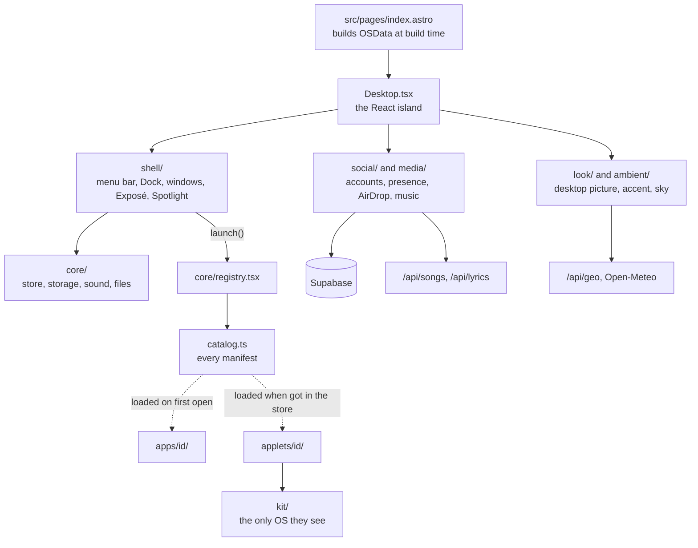

# The desktop

How JM/OS is put together, part by part. Read this before changing
anything under `src/os/`. Music and lyrics are in [media.md](media.md);
accounts, chat and presence in [supabase.md](supabase.md).

The home page (`src/pages/index.astro`) is JM/OS, a Mac OS X–style
desktop rendered by one client-only React island in `src/os/`. The page
also renders a visually hidden plain-text copy of the content for screen
readers, crawlers and visitors without JavaScript.

## How it fits together

The dotted lines are the only way into apps and applets: the OS reaches
them through the catalog, apps don't import each other, and applets see
only `kit/`. The lint enforces all three.

## Where things are

| Folder in `src/os/` | Holds | Start from |
| --- | --- | --- |
| `core/` | the store, types, registry, icons, sounds, storage, Macintosh HD | `store.ts`, `registry.tsx`, `storage.ts` |
| `shell/` | the menu bar, Dock, windows and the rest of the chrome | `Window.tsx`, `MenuBar.tsx`, `Dock.tsx` |
| `look/` | desktop pictures and the accent colour | `wallpapers.ts`, `accent.ts` |
| `ambient/` | the visitor's place, weather and sky | `place.ts`, `Sky.tsx` |
| `media/` | music, lyrics, listening along | see [media.md](media.md) |
| `social/` | Supabase: accounts, presence, chat, AirDrop | see [supabase.md](supabase.md) |
| `apps/` | the built-in apps, one folder each | `<id>/manifest.ts` |
| `applets/` | the Applet Store's games and tools | `<id>/manifest.ts` |
| `kit/` | everything applets may use | `index.ts` |
| `styles/` | the Aqua theme, by part of the desktop | `os.css` imports them |

## Apps and applets

- `src/os/catalog.ts` lists every app's manifest (`apps/<id>/manifest.ts`
  or `applets/<id>/manifest.ts`: name, icon, window size, where it
  appears, and how to load it); `AppId` is derived from it.
  `src/os/core/registry.tsx` turns the manifests into what the OS uses,
  with each app's component loaded lazily, and `launch()` opens one. `dockApps` and `mobileDockApps` pick what
  the Dock keeps (other apps appear there while open, except `noDock`
  panels); `launcherApps` is what Spotlight lists. Keep the Dock and the
  desktop (`shell/DesktopIcons.tsx`: Macintosh HD, About Me, Résumé,
  Projects) short; a phone's home screen lists every app.
- `src/os/apps/`: one folder per built-in app. Content comes from `OSData`,
  assembled at build time in `index.astro` from `src/i18n/content.ts`, the
  projects collection and `src/lib/photos.ts` (Unsplash, fetched at build).
- Applets are self-contained: each is a folder under `applets/` that
  imports only `src/os/kit` and its own files, never the rest of the OS or
  another applet (the lint enforces it). The kit gives them sounds, the
  sound setting, whether their window is in front, a game loop that stops
  when it isn't (`useGameLoop`), storage under their own `os-<id>` keys
  (`saved`, whose `update` builds on what's stored and `watch` hears the
  visitor's other tabs), a way to resize their window and the photo
  library. Anything new an applet needs from the OS is added to the kit,
  not imported around it.
- `src/os/core/applets.ts` and `apps/appstore/`: the Applet Store
  (Minesweeper, Tile Game, Calculator, Spider Solitaire, Pinball, Synth;
  each store page is the `applet` field of the applet's manifest). Which
  applets this browser has installed is kept in `os-applets`; installed
  applets appear in Finder's Applets folder and Spotlight. Getting one
  downloads its code and styles then (not before; `perf` checks none is
  in the first load), and it's listed only once they've arrived; a failed
  download leaves it uninstalled with a notification. An applet that
  isn't installed, asked for by a link, the Terminal or anything else
  that calls `launch()`, opens its page in the store. Removing one closes
  its windows and keeps what it saved, as a Mac keeps an app's
  preferences. An app whose code has arrived renders directly rather than
  through `lazy` (`readyApp()` in the registry), so it opens at once. To
  add one, see [adding.md](adding.md).
- Pinball's table, physics and rules are in `applets/pinball/table.ts`
  (table units, 400 × 700); keep it free of anything from Microsoft's
  Space Cadet.
- `src/os/applets/synth/`: an applet synthesizer on the shared
  AudioContext (`audio()` from the kit); it follows the sound switch
  and volume, and a note turns sound on. Settings in `os-synth`.
- The Terminal (`apps/terminal/`) has a working folder on Macintosh
  HD (`cd`, `pwd`, `ls`, `cat`, `open <path>`).
- `src/os/apps/photobooth/`: the camera with CSS-filter effects, a
  countdown and one or four pictures, kept in `os-photobooth` (the last
  eight, as small JPEGs). The camera is only on while the window is open.
- `src/os/apps/aboutmac/`: the Apple menu's About This Mac.
  `__JMOS_BUILD__` (defined in `astro.config.mjs` from Vercel's
  `VERCEL_GIT_COMMIT_SHA`) is the build's short commit hash.

## Windows and the shell

- `src/os/core/store.ts`: zustand store for windows (map + z-order array),
  theme and appearance, Spotlight, Dashboard, Exposé, the screensaver
  and its settings, the visitor's place and the chosen desktop picture.
- Open windows survive a reload (`src/os/core/windowSession.ts`, saved in
  `os-windows`); `?open=` wins. A first visit gets the Welcome window
  alone, centred (`os-welcomed`); otherwise the desktop starts clear.
  Nothing opens About by itself.
- `src/os/shell/Expose.tsx`: the Exposé grid (F9, the bottom-left hot
  corner or View → Exposé). Windows animate to their slot in place, so
  iframes don't reload.
- `src/os/shell/AppSwitcher.tsx`: ⌥Tab steps through open windows, most
  recent first; releasing ⌥ focuses the chosen one.
- `src/os/shell/drawer.tsx`: Tiger-style drawers. Each window has a slot
  along its edge (right, left if there's no room, or over the content
  when neither side fits); an app renders `<Drawer open>` anywhere and it
  appears there. Used by Photos (Info) and Finder (Get Info, ⌥I).
- `src/os/shell/genie.ts`: the displacement map behind the Genie minimize
  in `Window.tsx`.
- `src/os/core/notices.ts` and `shell/Notices.tsx`: Growl-style
  notifications (chat mentions, AirDrop offers). `shell/ContextMenu.tsx`
  is the right-click menu the desktop, the Dock and Finder share.
- The menu bar is see-through. Its text is white or black depending on
  how bright the top of the desktop picture is (`topBrightness()` in
  `accent.ts`, darkened by the sky's layers via `skyDimming()`), shown as
  `data-backdrop` on `.os-root`. It turns opaque over a zoomed window and
  on phones while an app is open. The Apple logo is tinted with the
  accent.
- `src/os/shell/Screensaver.tsx` and `savers.tsx`: Desktop Pictures (a
  slideshow of Mac OS X's scenic desktop pictures, `SCENIC` in
  `wallpapers.ts`), Flurry, Soapbox (the latest posts in large type),
  Starfield, Clock or Bounce, after the idle time chosen in System
  Preferences (two minutes by default).
- Phones are anything narrower than 768px or a short touch screen (a phone
  sideways): `isPhone()` and `PHONE_QUERY` in `src/os/core/store.ts`, and
  the same media query in the stylesheets.

## System Preferences, sound and settings

- `src/os/apps/preferences/`: System Preferences, as Leopard's: a Show
  All grid of panes in three rows (`panes.ts`, which also gives the words
  its search field and Spotlight find them by), back and forward, and a
  window titled after the pane. It opens from the Apple menu only
  (`menuOnly` in the registry): no Dock icon, not in Applications or on a
  phone's home screen. Panes: Appearance (light, dark, automatic, or
  follow the sun where the visitor is), Desktop & Screen Saver, Dock
  (size, magnification), Date & Time (place, 24-hour clock), Displays
  (Night Shift, motion), Sound, Accounts, Sharing (city, pointer, AirDrop),
  Software Update (compares the build with `main` on GitHub) and Backup &
  Restore (`backup.ts`: every `os-*` setting to a file and back, and a
  reset). Choices live in `localStorage` (`os-wallpaper`,
  `os-wallpaper-rotate`, `os-screensaver`, `theme`, `os-place`, and
  `os-system` for the rest, in `src/os/core/system.ts`). Animations ask
  `useReduceMotion()` there rather than motion's `useReducedMotion()`, so
  the Displays pane's choice wins over the device's.
- `src/os/core/sound.ts`: interface sounds synthesized with Web Audio (no
  recordings). Off by default; the menu bar speaker and the Sound pane
  turn them on (`os-sound` in `localStorage`). That one switch and volume
  govern every sound, the music included: anything new that plays audio
  must follow it (see `setLoudness()` in `music.ts`).

## Desktop picture, accent and sky

- `src/os/look/wallpapers.ts`: desktop pictures besides photos: ryOS's
  photo collections and tiles (`public/os/wallpapers/`, listed in
  `src/data/wallpapers.json`; photos are WebP, at most 2560px wide), solid
  colours, SVG/CSS patterns and a dynamic sky that follows the sun and
  weather at the visitor's place. The store keeps a photo URL or
  `color:<id>`, `pattern:<id>`, `dynamic:sky`; `backgroundFor()` turns
  it into CSS.
- The desktop picture changes to another from the same collection each
  time the visitor leaves the tab and comes back (`useDesktopPicture.ts`,
  `nextPicture()` in `wallpapers.ts`); the default moves on to `SCENIC`.
  A checkbox in System Preferences turns it off. Jincheng's own photos
  are only shown in Photos, never as the desktop or the screen saver.
- `src/os/look/accent.ts`: the accent colour. By default it's sampled from
  the desktop picture (the most prominent colourful hue, at a readable
  lightness); System Preferences can fix it instead. Everything blue in
  `os.css` derives from `--os-accent` via `color-mix()`.
- `src/os/ambient/place.ts`: where the visitor is. `api/geo.ts` (a Vercel
  Function) returns the city, coordinates and time zone Vercel derives
  from their IP address; the Weather widget's flip side lets them pick a
  city instead (kept in `localStorage`), and `?place=<city>` overrides
  both for demos. Without a location (e.g. `astro dev`) it falls back to
  San Jose's weather and the device clock.
- `src/os/ambient/Sky.tsx` and `weather.ts`: tint the wallpaper with the
  time of day and weather at that place (Open-Meteo), in °F or °C by
  country. `?sky=dusk,rain` pins both. The menu bar clock and the
  Dashboard's clock and calendar use the place's time zone; a Dashboard
  widget shows Jincheng's time in San Jose next to it.

## Finder, files and sharing

- `src/os/core/files.ts` and `apps/finder/`: Macintosh HD, a read-only
  file system built from the content (Applications, Applets, Documents,
  Music, Pictures, Projects), browsed in Finder with icon, list and
  column views, Quick Look (Space), keyboard navigation and a
  right-click menu. A file's `look` is what Quick Look shows.
- `src/os/social/airdrop.ts` and `apps/airdrop/`: AirDrop between
  signed-in members on the desktop (signed out, it asks you to sign in).
  Only a Macintosh HD path is sent, and the receiver looks it up on its
  own disk, so only JM/OS's own content can arrive; offers go over
  presence signals and must be accepted. Finder (right-click, drag onto
  AirDrop), Photos and project windows share.

## Social

- `src/os/social/social.ts`: Stickies (a guestbook) and presence (who's
  online and from which city, and, for a visitor who turns them on in
  System Preferences › Sharing, other visitors' pointers labelled with
  it) on Supabase. Other people's pointers are off by default: nobody's
  pointer crosses another screen uninvited. See [supabase.md](supabase.md).
- `src/os/apps/soapbox/`: Jincheng's own notes and rants, with
  photos. Posts come from a Telegram bot, `supabase/functions/soapbox-bot`
  (setup in its README): text, photos with captions, albums (one post)
  and images sent as files; photos are copied into the public `soapbox`
  storage bucket. Visitors read them and leave one emoji reaction per
  post.

## Styles and assets

- `src/os/os.css`: the Aqua theme, split by part of the desktop into
  `src/os/styles/` and imported in cascade order: the shell, and what
  several apps share (`components.css`, `source-list.css` for the
  Finder-style sidebar). Each app's own stylesheet lives in its folder and
  arrives with its code (see [adding.md](adding.md)), after all of these.
- Icons, fonts and the wallpaper under `public/os/` and `src/assets/os/`
  come from ryOS; see `NOTICE`. They stay (HANDOFF.md, decisions); icons
  for apps ryOS doesn't have are drawn in `core/icons.tsx` to match.

## Links, the tab title and the Chinese site

- Deep links: `/?open=<app|project-slug|dashboard|screensaver>` opens that
  window.
- The home page's browser tab says "Jincheng" (`tabTitle` in
  `Layout.astro`); link previews keep the full title.
- The Chinese site is offline for now: `/zh/*` redirects to the English
  paths (`vercel.json`). Keep the `zh` content in `content.ts` and the
  Chinese project files; they will be used again.
