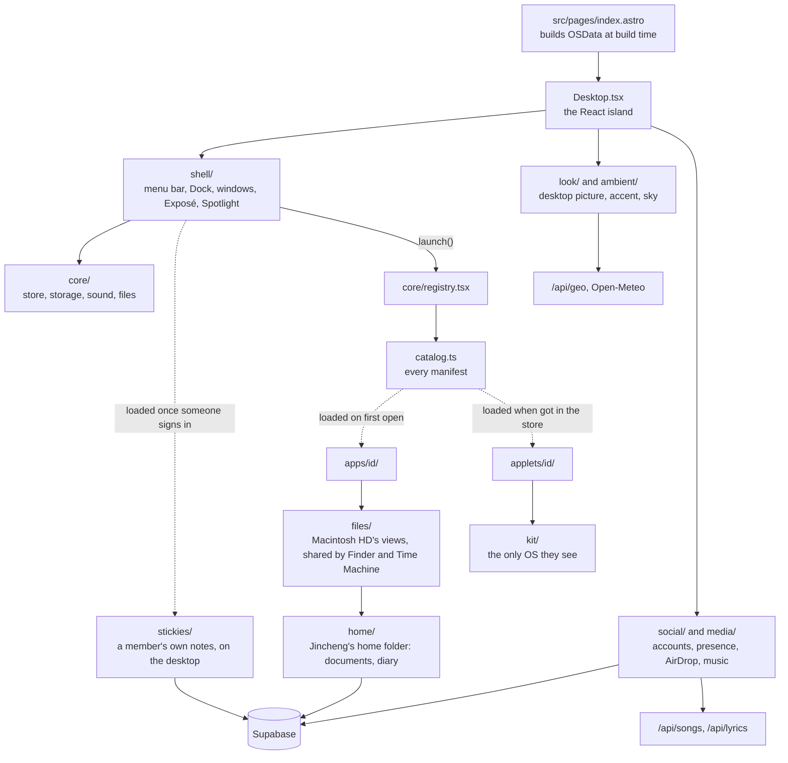

# The desktop

How JM/OS is put together, part by part. Read this before changing
anything under `src/os/`. Music and lyrics are in [media.md](media.md);
accounts, chat and presence in [supabase.md](supabase.md).

The home page (`src/pages/index.astro`) is JM/OS, a Mac OS X–style
desktop rendered by one client-only React island in `src/os/`. The page
also renders a visually hidden plain-text copy of the content for screen
readers, crawlers and visitors without JavaScript.

## How it fits together

The dotted lines are the only way into apps and applets: the OS reaches
them through the catalog, apps don't import each other, and applets see
only `kit/`. The lint enforces all three, on `import()` as well as import
declarations (a local rule in `eslint.config.js`), and over every folder
of `src/os/` but `apps/`, `applets/` and the catalog, so a new folder is
guarded from its first file; `tests/eslint.test.ts` probes each rule.

## Where things are

| Folder in `src/os/` | Holds | Start from |
| --- | --- | --- |
| `core/` | the store, types, registry, icons, sounds, storage, Macintosh HD | `store.ts`, `registry.tsx`, `storage.ts` |
| `shell/` | the menu bar, Dock, windows and the rest of the chrome | `Window.tsx`, `MenuBar.tsx`, `Dock.tsx` |
| `look/` | desktop pictures and the accent colour | `wallpapers.ts`, `accent.ts` |
| `ambient/` | the visitor's place, weather and sky | `place.ts`, `Sky.tsx` |
| `media/` | music, lyrics, listening along | see [media.md](media.md) |
| `social/` | Supabase: accounts, presence, chat, AirDrop | see [supabase.md](supabase.md) |
| `files/` | Macintosh HD's views and folders that Finder and Time Machine share | `parts.tsx`, `home.tsx`, `movies.tsx` |
| `home/` | Jincheng's home folder: the documents and the diary, from the database | `home.ts` |
| `stickies/` | a member's own stickies, on their desktop and in Stickies › Yours | `mine.ts`, `DesktopStickies.tsx` |
| `apps/` | the built-in apps, one folder each | `<id>/manifest.ts` |
| `applets/` | the Applet Store's games and tools | `<id>/manifest.ts` |
| `kit/` | everything applets may use | `index.ts` |
| `styles/` | the Aqua theme, by part of the desktop | `os.css` imports them |

## Apps and applets

- `src/os/catalog.ts` lists every app's manifest (`apps/<id>/manifest.ts`
  or `applets/<id>/manifest.ts`: name, the day it came, icon, window
  size, where it appears, and how to load it); `AppId` is derived from it.
  `src/os/core/registry.tsx` turns the manifests into what the OS uses,
  with each app's component loaded lazily, and `launch()` opens one. `dockApps` and `mobileDockApps` pick what
  the Dock keeps (other apps appear there while open, except `noDock`
  panels); `launcherApps` is what Spotlight lists. `dockApps` is only
  the default: on desktops the visitor rearranges the Dock
  (`core/dock.ts`, kept in `os-dock`): dragging an icon along it moves
  it, off it removes it (in a puff), and in from Finder's Applications
  or Applets (Finder puts the app id on the drag as `APP_MIME`), or a
  running app's slot dragged left, keeps it. The Dock menu has Keep in
  Dock and Remove from Dock; Finder stays first; System Preferences ›
  Dock restores the default. Phones keep `mobileDockApps`. The drag
  itself is `shell/dockDrag.tsx`, fetched once the desktop has settled
  or on the first press (it isn't in the first load); it writes
  `shell/dockDragState.ts` and the Dock draws it. Every slot opens and
  closes on one spring (`SLIDE` in `Dock.tsx`): a gap where a drop would
  land, a dragged or leaving app's slot closing, an arriving one
  opening, so a slot closing while another opens keeps the Dock still.
  A drop lands in one step (`instant`), with the dragged icon kept over
  its place until the slot shows. With motion reduced, slots jump. Keep the Dock and the
  desktop (`shell/DesktopIcons.tsx`: Macintosh HD, About Me, Résumé,
  Projects) short, and nothing is added to them, not even a disc in DVD
  Player's drive (Jincheng's rule, 2026-09-29); a phone's home screen lists every app.
- `src/os/apps/`: one folder per built-in app. Content comes from `OSData`,
  assembled at build time in `index.astro` from `src/i18n/content.ts`, the
  projects collection and `src/lib/photos.ts` (Unsplash, fetched at build).
- Applets are self-contained: each is a folder under `applets/` that
  imports only `src/os/kit` and its own files, never the rest of the OS or
  another applet (the lint enforces it). The kit gives them sounds, the
  sound setting, whether their window is in front, a game loop that stops
  when it isn't (`useGameLoop`), storage under their own `os-<id>` keys
  (`saved`, whose `update` builds on what's stored and `watch` hears the
  visitor's other tabs), a way to resize their window and the photo
  library. Anything new an applet needs from the OS is added to the kit,
  not imported around it.
- `src/os/core/applets.ts` and `apps/appstore/`: the Applet Store
  (Minesweeper, Tile Game, Calculator, Spider Solitaire, Pinball, Synth;
  each store page is the `applet` field of the applet's manifest). Which
  applets this browser has installed is kept in `os-applets`; installed
  applets appear in Finder's Applets folder and Spotlight. Getting one
  downloads its code and styles then (not before; `perf` checks none is
  in the first load), and it's listed only once they've arrived; a failed
  download leaves it uninstalled with a notification. An applet that
  isn't installed, asked for by a link, the Terminal or anything else
  that calls `launch()`, opens its page in the store. Removing one closes
  its windows and keeps what it saved, as a Mac keeps an app's
  preferences. An app whose code has arrived renders directly rather than
  through `lazy` (`readyApp()` in the registry), so it opens at once. To
  add one, see [adding.md](adding.md).
- Pinball's table, physics and rules are in `applets/pinball/table.ts`
  (table units, 400 × 700); keep it free of anything from Microsoft's
  Space Cadet.
- `src/os/applets/synth/`: an applet synthesizer on the shared
  AudioContext (`audio()` from the kit); it follows the sound switch
  and volume, and a note turns sound on. Settings in `os-synth`.
- The Terminal (`apps/terminal/`) has a working folder on Macintosh
  HD (`cd`, `pwd`, `ls`, `cat`, `open <path>`).
- `src/os/apps/photobooth/`: the camera with CSS-filter effects, a
  countdown and one or four pictures, kept in `os-photobooth` (the last
  eight, as small JPEGs). The camera is only on while the window is open.
- `src/os/apps/aboutmac/`: the Apple menu's About This Mac.
  `__JMOS_BUILD__` (defined in `astro.config.mjs` from Vercel's
  `VERCEL_GIT_COMMIT_SHA`) is the build's short commit hash.
- `src/os/apps/chess/`: Tiger's Chess, in Applications (not kept in the
  Dock). The visitor plays White against the computer on a wooden board
  in perspective (CSS 3D, `chess.css`): click a piece, then one of the
  squares it can go to (tinted, ringed where it takes; the squares
  alone take clicks, as the board lies in their plane). Rules, check,
  mate, stalemate, draws and promotion are chess.js's (BSD-2-Clause,
  `rules.ts`). The computer (`engine.ts`, with tests) is a small
  alpha-beta search, three moves deep then captures until quiet, scored
  by material and piece-square tables; below its own move it plays
  through chess.js's internal move list (`_moves`, `_makeMove`,
  `_undoMove`, as chess.js's `perft` does), since the public `move()`
  writes out notation and positions and makes a search about ten times
  slower. It thinks in a Web Worker (`engine.worker.ts`, 1.5 s at most,
  or two moves deep), or on the page if the worker can't start. The game
  is kept in `os-chess` (its moves), so a reload goes on; every tab of a
  visitor shows the same game, and when two tabs think at once the
  first answer is played and the other tab takes it. New Game is in the
  Game menu and in the status bar (phones have no app menus).
- `src/os/apps/timemachine/`: Leopard's Time Machine, in the Dock and
  Applications. It's a full-screen app (the manifest's `fullScreen`,
  drawn by `shell/FullScreenLayer.tsx`): no window; it covers the
  windows, the menu bar and the Dock, which are `inert` under it, and
  the desktop's shortcuts, the ⌥Tab switcher and Exposé's corner stay
  quiet (`useFocusedId()` is null meanwhile, so no window has the keys).
  Space is a canvas of seeded stars over a CSS nebula, with a Finder
  window for each day going back into it (300px apart, seen from 50%
  6%, as the prototype had them); the timeline down the right, the
  arrows (Page Up and Down) and a click on a window behind go through
  the days, and Cancel or Escape leaves. What a day held is `past.ts`:
  each thing from the day it came, an app from its manifest's `added`
  (an applet from its listing's), a song or an album from its Date
  Added, a disc from when it was burned, Jincheng's documents and diary
  entries from when they were first written, and the Applets, Movies and
  Users folders from the days the Applet Store, DVD Player and TextEdit
  came. Nothing keeps how a thing was changed or what was thrown away,
  so a past day shows what's here now, as far back as each thing goes;
  Pictures and Projects have no dates and aren't shown. Days are where
  this device is. The front window is a read-only Finder
  (`Browser.tsx`): the places, back and forward, icons or a list, and
  Quick Look; the folder, the selection and the view stay as the days
  change, and a day without the folder shows the nearest one it had.
  Restore brings what's chosen (or the folder shown) back to now: an
  app opens, a song plays, a disc goes into the drive, a document opens
  in TextEdit, a folder opens in Finder. The home folder is read as
  Finder reads it, so anyone else sees only Public and Sites.
- `src/os/apps/dvdplayer/`: Tiger's DVD Player, in Applications (not
  kept in the Dock), for the discs on Finder's Movies shelf (see
  [media.md](media.md)). A window named after the disc in the drive
  (`media/drive.ts`) shows its menu (Play Movie, Scene Selection, Loop)
  and then the picture, always 16:9 with black around it; its own
  YouTube player (`useDiscPlayer.ts`) takes no pointer, so YouTube's
  hover controls never come up (its middle button after a play or a seek
  does, and DVD Player masks it: [media.md](media.md)). The Controller is a floating panel, as on a
  Mac: drawn by the app into `.os-root` just above the windows, shown
  only while DVD Player is the window in front (not in Exposé or
  minimized), dragged by its metal and left where it was put
  (`os-dvd`). Full screen (⌘F, a double-click on the picture, the
  Controls menu) is Leopard's (`FullScreen.tsx`): the browser's full
  screen on the picture itself, since the player can't move without
  reloading, with the chapters along the top and the controls along the
  bottom, which rest out of sight (and the pointer with them) 2.5 s after
  the pointer stops while the disc plays. Its position slider
  (`core/useScrub.ts`) stays where it's put: dragged, it seeks within
  what's loaded as it goes and properly where it's let go, and the clock
  doesn't move it back meanwhile. What DVD Player says for a moment
  ("Chapter 2", "▶ Play") shows in the corner once the chapters have
  gone, not under them. A slider used with the pointer (volume,
  position) gives the keys back when it's let go
  (`releaseAfterPointer` in `core/useKeys.ts`), so Space and the arrows
  stay DVD Player's; tabbed to, it keeps them. The Controller's buttons
  leave them to DVD Player too, as a panel of its own (`data-panel`,
  `ownsKey` in `core/useKeys.ts`). A phone, which DVD Player fills
  anyway, always has that look instead of the Controller. The Controls
  menu and the keys (Space, ←/→ for chapters, ↑/↓ and Return in menus,
  Escape, ⌘F, ⌘E) do what its buttons do. A disc slides into the slot in the
  screen's right edge on its way in and out (`media/insertion.ts`, Web
  Animations, skipped with motion reduced), and DVD Player's icon
  bounces in the Dock as it opens. The disc never goes on the desktop:
  Jincheng wants no icons added there (2026-09-29), so the Controller and
  ⌘E are the ways to eject it.

## Windows and the shell

- `src/os/core/store.ts`: zustand store for windows (map + z-order array),
  theme and appearance, Spotlight, Dashboard, Exposé, the screensaver
  and its settings, the visitor's place and the chosen desktop picture.
- Open windows survive a reload (`src/os/core/windowSession.ts`, saved in
  `os-windows`); `openSession()` puts them back and then opens what a
  `?open=` link names on top of them, once: `open` leaves the address as
  it's handled (`history.replaceState` in `core/deepLink.ts`), so a reload
  brings the session back, the link's target among it, rather than the
  target alone (#189). With neither a session nor a link, a first visit
  gets the Welcome window alone, centred (`os-welcomed`); otherwise the
  desktop starts clear. Nothing opens About by itself.
- The browser's size is the store's `viewport` (`watchViewport()` in
  `core/store.ts`, started by `Desktop.tsx`). A resize or a rotation
  fits every window to it once per animation frame, however many events
  arrive in one (`fitToViewport`, which `restoreWindows` uses too, so a
  reload and a resize agree): a window keeps its size where it still
  fits, shrinks where it doesn't, and is pulled back so its title bar is
  in reach (`fitWindow`); one that fits keeps its object, so it doesn't
  render again. Zoomed windows and a phone's apps take their frame from
  `viewport` (`zoomedFrame`, `phoneFrame`) and are the only windows that
  select it; unzooming returns to the saved size, fitted. Exposé lays
  out again while it's open, and a member's stickies are kept within
  reach (below). It's the browser's inner size (`innerWidth` ×
  `innerHeight`), never `visualViewport`: a phone's keyboard or a pinch
  zoom changes only the visual viewport and leaves the apps alone
  (#192).
- `src/os/shell/Expose.tsx`: the Exposé overlay (F9, the bottom-left hot
  corner or View → Exposé); the grid itself is `exposeLayout.ts`, a
  plain module with a test, laid out for the browser's size and again
  when it changes (`WindowLayer` in `Desktop.tsx`). Windows animate to
  their slot in place, so iframes don't reload. While it's open it has
  the keys, before any window (Escape leaves it and does nothing else;
  F9 and ⌘ keys are the desktop's).
- `src/os/shell/AppSwitcher.tsx`: ⌥Tab steps through open windows, most
  recent first; releasing ⌥ focuses the chosen one.
- `src/os/core/useKeys.ts`: whose a key is. A handler on `window`
  (`useKeys`; Finder's, the iPod's centre key, Time Machine's browser,
  Job Hunt's, iCal's, TextEdit's, Stickies', an alert's, the Burn
  sheet's) listens only while its window is in front
  (`useFocusedId() === win.id`) and takes a key only when `ownsKey(e)`
  says it's the app's: an unmodified key with focus on the page itself
  or anywhere in the window (a panel the app draws outside it, DVD
  Player's Controller, counts as inside by its `data-panel`), never on a
  control elsewhere, which keeps its own Return, Space and arrows: a
  Dock icon, the menu bar and its menus, a window's close box (the title
  bar is the shell's), another window. ⌘ and ⌥ shortcuts are the front
  app's wherever focus is, as menu commands are, except in a text field,
  where only ⌘ gets through: ⌥ with a key types a character there
  (`typing(e)`, which the desktop's ⌥W, ⌥M and ⌥T in
  `shell/useShortcuts.ts` check as well). Applets get `ownsKey` from the
  kit (Pinball). Exposé, the ⌥Tab switcher and a full-screen app's own
  keys (Time Machine's Escape and Page Up/Down) hold theirs wherever
  focus is, and an Escape closes Quick Look before it leaves Time
  Machine.
- `src/os/shell/drawer.tsx`: Tiger-style drawers. Each window has a slot
  along its edge (right, left if there's no room, or over the content
  when neither side fits); an app renders `<Drawer open>` anywhere and it
  appears there. Used by Photos (Info) and Finder (Get Info, ⌥I).
- `src/os/shell/genie.ts`: the displacement map behind the Genie minimize
  in `Window.tsx`.
- `src/os/core/notices.ts` and `shell/Notices.tsx`: Growl-style
  notifications (chat mentions, AirDrop offers). `shell/ContextMenu.tsx`
  is the right-click menu the desktop, the Dock and Finder share.
- The menu bar's menus after File come from the front window: the iPod
  and Karaoke's Controls, and any app's own, which it sets with
  `setMenus(win.id, menus)` in the store while it's open (Chess's Game
  menu, DVD Player's Controls). Phones show only the Apple menu, so what's in an app's menus
  needs a way in from its window too.
- The menu bar is see-through. Its text is white or black depending on
  how bright the top of the desktop picture is (`topBrightness()` in
  `accent.ts`, darkened by the sky's layers via `skyDimming()`), shown as
  `data-backdrop` on `.os-root`. It turns opaque over a zoomed window and
  on phones while an app is open. The Apple logo is tinted with the
  accent.
- `src/os/shell/DesktopLyrics.tsx`: the playing song's lyrics floating
  over the desktop, when the visitor turns them on; see
  [media.md](media.md).
- `src/os/shell/Screensaver.tsx` and `savers.tsx`: Desktop Pictures (a
  slideshow of Mac OS X's scenic desktop pictures, `SCENIC` in
  `look/pictureSets.ts`), Flurry, iTunes Artwork, Soapbox (the latest posts in
  large type), Starfield, Clock or Bounce, after the idle time chosen in
  System Preferences (two minutes by default). The views and their list
  (`SAVER_STYLES`) are in `saverViews.tsx`, off the first load.
  iTunes Artwork is Leopard's: the music library's covers on a wall of
  square tiles (album covers and songs' own; a song without art has
  none), each dealt once before any repeats and never beside itself,
  one tile turning over every 2.5 s to a cover the wall shows least
  (`artwork.ts`, with tests). The next cover is fetched before it
  turns, a broken one is dropped, and nothing turns while the page is
  hidden. The preview in System Preferences is the same wall in
  miniature (columns follow the screen's width). With motion reduced, a
  cover fades into the next in place. Its stylesheet, `artwork.css`,
  arrives as text with the view, like an app's.
- Phones are anything narrower than 768px or a short touch screen (a phone
  sideways): `isPhone()` and `PHONE_QUERY` in `src/os/core/store.ts`, and
  the same media query in the stylesheets. The store's `phone` says the
  same as of the last change of the viewport, for what renders by it
  (`Window`), so a window follows a browser that crosses the line.

## System Preferences, sound and settings

- `src/os/apps/preferences/`: System Preferences, as Leopard's: a Show
  All grid of panes in three rows (`panes.ts`, which also gives the words
  its search field and Spotlight find them by), back and forward, and a
  window titled after the pane. It opens from the Apple menu only
  (`menuOnly` in the registry): no Dock icon, not in Applications or on a
  phone's home screen. Panes: Appearance (light, dark, automatic, or
  follow the sun where the visitor is), Desktop & Screen Saver, Dock
  (size, magnification), Date & Time (place, 24-hour clock), Displays
  (Night Shift, motion), Sound, Accounts, Sharing (city, pointer, AirDrop),
  Software Update (compares the build with `main` on GitHub) and Backup &
  Restore (`backup.ts`: every `os-*` setting to a file and back, and a
  reset). Choices live in `localStorage` (`os-wallpaper`,
  `os-wallpaper-rotate`, `os-screensaver`, `theme`, `os-place`, and
  `os-system` for the rest, in `src/os/core/system.ts`). Animations ask
  `useReduceMotion()` there rather than motion's `useReducedMotion()`, so
  the Displays pane's choice wins over the device's.
- `src/os/core/sound.ts`: interface sounds synthesized with Web Audio (no
  recordings). Off by default; the menu bar speaker and the Sound pane
  turn them on (`os-sound` in `localStorage`). That one switch and volume
  govern every sound, the music included: anything new that plays audio
  must follow it (see `setLoudness()` in `music.ts`).

## Desktop picture, accent and sky

- `src/os/look/wallpapers.ts`: desktop pictures besides photos: ryOS's
  tiles (`public/os/wallpapers/tiles`, listed in
  `src/data/wallpaper-tiles.json`), solid colours, SVG/CSS patterns and a
  dynamic sky that follows the sun and weather at the visitor's place.
  The store keeps a photo URL or `color:<id>`, `pattern:<id>`,
  `dynamic:sky`; `backgroundFor()` turns it into CSS.
- `src/os/look/pictureSets.ts`: ryOS's photo collections
  (`public/os/wallpapers/photos`, listed in `src/data/wallpapers.json`;
  WebP, at most 2560px wide), stored as a photo's URL. Only choosing a
  picture needs the list, so it's off the first load: Preferences, the
  screen saver and the change below load it.
- The desktop picture changes to another from the same collection each
  time the visitor leaves the tab and comes back (`useDesktopPicture.ts`,
  `nextPicture()` in `pictureSets.ts`, loaded as the tab is left); the
  default moves on to `SCENIC`.
  A checkbox in System Preferences turns it off. Jincheng's own photos
  are only shown in Photos, never as the desktop or the screen saver.
- `src/os/look/accent.ts`: the accent colour. By default it's sampled from
  the desktop picture (the most prominent colourful hue, at a readable
  lightness); System Preferences can fix it instead. Everything blue in
  `os.css` derives from `--os-accent` via `color-mix()`.
- `src/os/ambient/place.ts`: where the visitor is. `api/geo.ts` (a Vercel
  Function) returns the city, coordinates and time zone Vercel derives
  from their IP address; the Weather widget's flip side lets them pick a
  city instead (kept in `localStorage`), and `?place=<city>` overrides
  both for demos. Without a location (e.g. `astro dev`) it falls back to
  San Jose's weather and the device clock.
- `src/os/ambient/Sky.tsx` and `weather.ts`: tint the wallpaper with the
  time of day and weather at that place (Open-Meteo), in °F or °C by
  country. `?sky=dusk,rain` pins both. The menu bar clock and the
  Dashboard's clock and calendar use the place's time zone; a Dashboard
  widget shows Jincheng's time in San Jose next to it.

## Finder, files and sharing

- `src/os/apps/browser/`: the Browser. A history (◀ ▶ step through the
  addresses opened in it; links followed inside a page can't be read
  from another site's frame), Home, a Bookmarks Bar (the projects'
  demos, then classic sites in their early years) and a year menu that
  shows the page as the Internet Archive kept it
  (`web.archive.org/web/<year>0701if_/<address>`, which the archive
  redirects to its nearest copy; no server of ours in between). A page
  that forbids framing gets a notice with "Open in a New Tab" instead of
  a blank window, from `/api/framing`.
- `src/os/core/files.ts`, `files/` and `apps/finder/`: Macintosh HD, a read-only
  file system built from the content (Applications, Applets, Documents,
  Movies, Music, Pictures, Projects), browsed in Finder with icon, list,
  column and Cover Flow views (⌥1–⌥4), Quick Look (Space), keyboard
  navigation and a right-click menu. Cover Flow (`CoverFlowView.tsx`) is
  Leopard's: the folder's items in a row over their reflections (a disc
  as its case, a photo as its picture, anything else as its icon, sized
  to the row's height) above the list, dragged, scrolled with the dark
  scroller or the arrow keys, a cover clicked to the front; only the
  covers near the middle are drawn. Its classes are `os-finder-cf-*`,
  apart from the iPod's `os-cf-*`. The Movies folder has a fifth view,
  the wooden shelf (`ShelfView.tsx`, ⌥5): the cases standing face out on
  wooden boards, as Delicious Library kept a collection. It's the one
  thing on the desktop that isn't Apple's look, kept on purpose; its
  button shows only in Movies, and anywhere else the choice shows icons. A file's `look` is what Quick Look shows (a picture,
  or a `View` of its own), `openLabel` its button ("Play DVD"), `trash`
  what Move to Trash (⌘⌫) does and `share: false` keeps it from AirDrop.
  Movies is DVD Player's shelf: Finder builds it (`files/movies.tsx`
  from `media/discs.ts`) and hands it to `buildDisk`, so the desktop's
  own copy of the disk (AirDrop's, in the first load) has no Movies and
  none of its code. In Movies the toolbar has Burn (`BurnSheet.tsx`) and
  the list shows Date Added, Length and Kind. The Burn sheet and Finder's
  alerts are modal: while one is up, Finder's own keys are off, and the
  sheet takes Escape (stop, or close) and Return (Burn) wherever in the
  window the focus is (a control outside it, a Dock icon, keeps its own:
  `ownsKey`). On a phone the toolbar's buttons keep their size and what
  doesn't fit goes to a second row, where the search field takes the
  rest of the width.
- What Time Machine shows as well lives in `files/`: a file's picture
  with the locked badge, the date and path helpers (`parts.tsx`), Quick
  Look, the Movies and Users folders, and their styles (`files.css`,
  which `finder.css` and `timemachine.css` import).
- Users › jincheng is Jincheng's home folder (`files/home.tsx`,
  handed to `buildDisk` as Movies is, and first in the sidebar with the
  house FileVault puts on a locked home): Desktop, Documents, Downloads,
  Library, Movies, Music, Pictures, Public and Sites. To anyone but the
  owner every folder but Public and Sites is `locked`: it wears Mac OS
  X's red "no access" badge (drawn in `Thumb`, so every view has it) and
  opening it, from any view, the sidebar or a path, brings up Finder's
  alert ("The folder … could not be opened because you do not have
  sufficient access privileges."). Signed in as the owner, they open and
  hold Jincheng's documents, and Documents holds the diary, a year to a
  document ("Diary 2026.rtf"). Public holds what Jincheng lets everyone
  read; Sites, the projects' live sites as Internet locations that open
  in the Browser. The documents come from the database (`home/home.ts`,
  [supabase.md](supabase.md)), which gives anyone else only Public's,
  read when a folder under Users shows (at most every 30 s, again when
  the tab comes back, and at once when another tab of the owner's saves
  or deletes something: `useHomeRefresh`, told over the `os-home`
  BroadcastChannel, as stickies and iCal are; a tab showing nothing of
  the home reads again the next time it does). Move to Trash on one of
  the owner's documents asks first ("will be deleted immediately"),
  since there's no Trash to take it back from.
- `src/os/apps/textedit/`: TextEdit, in Applications. A white page for
  one of Jincheng's documents (`DocumentPage.tsx`), or a year of the
  diary (`DiaryPage.tsx`): the days newest first under their dates in
  grey, each entry a paragraph that grows as it's typed, and this year's
  with today at the top and a line to write a new entry on. The owner
  writes; anyone else can only read a document in Public. What's typed
  is saved once the typing rests for a second, at once with ⌘S, and when
  the window closes (`useAutosave.ts`), and kept as a draft in the
  browser until it is, so a closed tab loses nothing: a draft found as a
  page opens (a document's, a new document's, a diary entry's) is saved
  again then, as a sticky's is (#190). A save names the version it was
  typed over, so one from an older copy, a restored draft's included, is
  refused and the alert offers Revert or Save Anyway. File › New (⌥N; the browser
  keeps ⌘N) starts a document that goes into Documents as "Untitled.txt"
  once something is typed; Save As (⇧⌘S, `SaveAsSheet.tsx`) renames it
  or moves it to another folder, Public included. An emptied diary entry
  is taken out when it's left. A save or a delete in one of the owner's
  tabs reaches the pages open in the others at once (`os-home`, above);
  a page with unsaved typing keeps it, and its next save meets the
  conflict alert. Entries and documents also come from Telegram (the
  bot's `/diary` and `/doc`); they show on the next read of the home
  folder (at most 30 s, or when the tab comes back).
- `src/os/shell/Alert.tsx` (with `alert.css`, which an app's stylesheet
  imports): an app's alert as Tiger drew one, the app's icon beside the
  message, with OK, Cancel and a third choice, Return and Escape. It
  takes the keys only while its window is in front: one that comes up
  behind (a save refused after the window was left) waits, and Return
  typed in another window stays that window's, as Return on a control
  outside the window (a Dock icon) stays that control's (`ownsKey` in
  `core/useKeys.ts`).
- `src/os/social/airdrop.ts` and `apps/airdrop/`: AirDrop between
  signed-in members on the desktop (signed out, it asks you to sign in).
  Only a Macintosh HD path is sent, and the receiver looks it up on its
  own disk, so only JM/OS's own content can arrive; offers go over
  presence signals and must be accepted. Finder (right-click, drag onto
  AirDrop), Photos and project windows share.

## Social

- `src/os/apps/ical/`: iCal, in Applications: a member's own days and
  to-dos, which only they see (`calendar.ts`; the tables in
  [supabase.md](supabase.md)); signed out, it says how to have some.
  Tiger's brushed metal round the calendars (Home and Work, each shown or
  hidden on this device, and a little month under them), the month
  (six weeks from the Sunday on or before its first day; a day lists
  three events and "more…") and To Do. A double-click on a day makes an
  event there, all day, its title chosen to be typed over in the info
  drawer (`EventInfo.tsx`: title, all day or from and to, the day, the
  calendar, notes); File › New Event (⌥N) and New To Do (⌥K) as ⌘N and ⌘K
  were. To-dos tick off, rename with a click, and take their priority,
  when they're due and their calendar from a right-click
  (`Todos.tsx`). The arrow keys move the day chosen; Delete deletes its
  event, asked first. Events are read six weeks at a time as the month
  moves, to-dos whole; the member's other tabs read again on every
  change. Narrow (a phone), it shows the month or To Do, chosen at the
  top.
- `src/os/apps/jobhunt/`: Job Hunt, in Applications, with Bento's icon:
  every company Jincheng has applied to (`jobs.ts`; the tables in
  [supabase.md](supabase.md)). Jincheng sees a board in iCal's brushed
  metal, a column to a stage (Applied, Assessment, Interviewing, Offer,
  Closed), a card to an application, the one that moved last on top;
  a card still Applied after 14 days with no word says how long it has
  waited. Drag a card to another column when something happens that Mail
  didn't say. The stages and sources on the left show and hide columns
  and filter, with how far they got under them; iTunes' capacity bar
  along the bottom. Or the list (⌥2), sorted by a header. The info drawer
  (⌥I, or a double-click) renames, moves, dates and notes one, and lists
  what Mail said about it, each message a link back to Gmail; ⌥N adds
  one by hand, Delete deletes one, asked first. Saves to one application
  go one after another, each from the version the last one got, so a
  note left by clicking the stage menu doesn't meet a refusal of its
  own. Anyone else sees only the numbers (Jincheng decided on
  2026-09-29): how many at each stage on blank cards, how far they got
  and the capacity bar, from `job_hunt_totals()`. What Mail said comes in
  through Claude and `scripts/job-hunt-import.mjs` (HANDOFF.md, Job
  Hunt). Narrow (a phone), one stage at a time, picked at the top, and the
  drawer's contents in the window.
- `src/os/stickies/`: a member's own stickies (`mine.ts`, the table in
  [supabase.md](supabase.md)). Signed in, a member's notes sit on their
  own desktop (`DesktopStickies.tsx`, drawn by `shell/DesktopStickiesLayer.tsx`,
  whose code comes only once someone signs in, so none of it is in the
  first load), above its icons and below every window, each where it
  was left (shown within reach of a smaller browser, `onScreen` in
  `mine.ts`, without moving it: nothing is written on a resize, and the
  place it was left stands for the screen it was left on): held by its
  strip to move it, by the corner to size it,
  rolled up with a double-click on the strip (Tiger's window shade), a
  right-click for its colour, and the close box to take it down (asked
  first if there's anything on it). What's typed saves once the typing
  rests (`core/useAutosave.ts`, shared with TextEdit) and is kept as a
  draft until it has; a save from an older copy asks Use That or Keep
  This. The member's other tabs read them again on every change
  (`BroadcastChannel`), and another account never sees them, even for a
  moment. New Sticky Note on the desktop's right-click menu puts one
  where it was clicked; Stickies › Yours lists them as cards, with File ›
  New Sticky (⌥N), and is where they live on a phone, which has no
  desktop for them. Font: Marker Felt, where the device has it.
- `src/os/social/social.ts`: Stickies (a guestbook) and presence (who's
  online and from which city, and, for a visitor who turns them on in
  System Preferences › Sharing, other visitors' pointers labelled with
  it) on Supabase. Other people's pointers are off by default: nobody's
  pointer crosses another screen uninvited. See [supabase.md](supabase.md).
- `src/os/apps/soapbox/`: Jincheng's own notes and rants, with
  photos. Posts come from a Telegram bot, `supabase/functions/soapbox-bot`
  (setup in its README): text, photos with captions, albums (one post)
  and images sent as files; photos are copied into the public `soapbox`
  storage bucket. Visitors read them and leave one emoji reaction per
  post.

## Styles and assets

- `src/os/os.css`: the Aqua theme, split by part of the desktop into
  `src/os/styles/` and imported in cascade order: the shell, and what
  several apps share (`components.css`, `source-list.css` for the
  Finder-style sidebar). Each app's own stylesheet lives in its folder and
  arrives with its code (see [adding.md](adding.md)), after all of these.
- Icons, fonts and the wallpaper under `public/os/` and `src/assets/os/`
  come from ryOS; see `NOTICE`. They stay (HANDOFF.md, decisions); icons
  for apps ryOS doesn't have are drawn in `core/icons.tsx` to match.

## Links, the tab title and the Chinese site

- Deep links: `/?open=<app|project-slug|dashboard|screensaver>` opens that
  window over the saved session, once; the address loses `open` (and a
  reset link's token) as it's handled, so a reload doesn't open it again
  (`core/deepLink.ts`). An applet not installed opens its store page, and
  Time Machine takes the screen, as from anywhere else (`launch()`).
- The home page's browser tab says "Jincheng" (`tabTitle` in
  `Layout.astro`); link previews keep the full title.
- The Chinese site is offline for now: `/zh/*` redirects to the English
  paths (`vercel.json`). Keep the `zh` content in `content.ts` and the
  Chinese project files; they will be used again.
