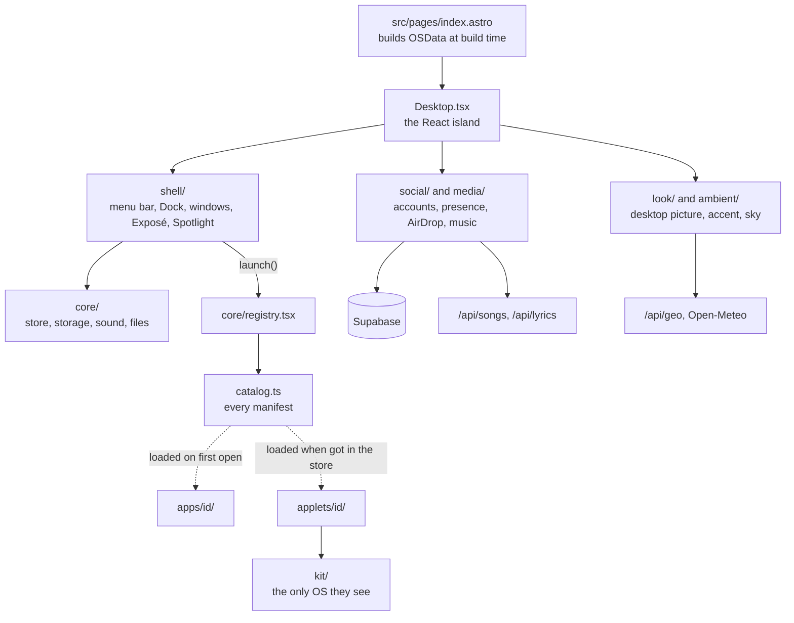

# The desktop

How JM/OS is put together, part by part. Read this before changing
anything under `src/os/`. Music and lyrics are in [media.md](media.md);
accounts, chat and presence in [supabase.md](supabase.md).

The home page (`src/pages/index.astro`) is JM/OS, a Mac OS X–style
desktop rendered by one client-only React island in `src/os/`. The page
also renders a visually hidden plain-text copy of the content for screen
readers, crawlers and visitors without JavaScript.

## How it fits together

The dotted lines are the only way into apps and applets: the OS reaches
them through the catalog, apps don't import each other, and applets see
only `kit/`. The lint enforces all three.

## Where things are

| Folder in `src/os/` | Holds | Start from |
| --- | --- | --- |
| `core/` | the store, types, registry, icons, sounds, storage, Macintosh HD | `store.ts`, `registry.tsx`, `storage.ts` |
| `shell/` | the menu bar, Dock, windows and the rest of the chrome | `Window.tsx`, `MenuBar.tsx`, `Dock.tsx` |
| `look/` | desktop pictures and the accent colour | `wallpapers.ts`, `accent.ts` |
| `ambient/` | the visitor's place, weather and sky | `place.ts`, `Sky.tsx` |
| `media/` | music, lyrics, listening along | see [media.md](media.md) |
| `social/` | Supabase: accounts, presence, chat, AirDrop | see [supabase.md](supabase.md) |
| `apps/` | the built-in apps, one folder each | `<id>/manifest.ts` |
| `applets/` | the Applet Store's games and tools | `<id>/manifest.ts` |
| `kit/` | everything applets may use | `index.ts` |
| `styles/` | the Aqua theme, by part of the desktop | `os.css` imports them |

## Apps and applets

- `src/os/catalog.ts` lists every app's manifest (`apps/<id>/manifest.ts`
  or `applets/<id>/manifest.ts`: name, icon, window size, where it
  appears, and how to load it); `AppId` is derived from it.
  `src/os/core/registry.tsx` turns the manifests into what the OS uses,
  with each app's component loaded lazily, and `launch()` opens one. `dockApps` and `mobileDockApps` pick what
  the Dock keeps (other apps appear there while open, except `noDock`
  panels); `launcherApps` is what Spotlight lists. `dockApps` is only
  the default: on desktops the visitor rearranges the Dock
  (`core/dock.ts`, kept in `os-dock`): dragging an icon along it moves
  it, off it removes it (in a puff), and in from Finder's Applications
  or Applets (Finder puts the app id on the drag as `APP_MIME`), or a
  running app's slot dragged left, keeps it. The Dock menu has Keep in
  Dock and Remove from Dock; Finder stays first; System Preferences ›
  Dock restores the default. Phones keep `mobileDockApps`. The drag
  itself is `shell/dockDrag.tsx`, fetched once the desktop has settled
  or on the first press (it isn't in the first load); it writes
  `shell/dockDragState.ts` and the Dock draws it. Every slot opens and
  closes on one spring (`SLIDE` in `Dock.tsx`): a gap where a drop would
  land, a dragged or leaving app's slot closing, an arriving one
  opening, so a slot closing while another opens keeps the Dock still.
  A drop lands in one step (`instant`), with the dragged icon kept over
  its place until the slot shows. With motion reduced, slots jump. Keep the Dock and the
  desktop (`shell/DesktopIcons.tsx`: Macintosh HD, About Me, Résumé,
  Projects, and a disc while one is in DVD Player's drive) short; a phone's home screen lists every app.
- `src/os/apps/`: one folder per built-in app. Content comes from `OSData`,
  assembled at build time in `index.astro` from `src/i18n/content.ts`, the
  projects collection and `src/lib/photos.ts` (Unsplash, fetched at build).
- Applets are self-contained: each is a folder under `applets/` that
  imports only `src/os/kit` and its own files, never the rest of the OS or
  another applet (the lint enforces it). The kit gives them sounds, the
  sound setting, whether their window is in front, a game loop that stops
  when it isn't (`useGameLoop`), storage under their own `os-<id>` keys
  (`saved`, whose `update` builds on what's stored and `watch` hears the
  visitor's other tabs), a way to resize their window and the photo
  library. Anything new an applet needs from the OS is added to the kit,
  not imported around it.
- `src/os/core/applets.ts` and `apps/appstore/`: the Applet Store
  (Minesweeper, Tile Game, Calculator, Spider Solitaire, Pinball, Synth;
  each store page is the `applet` field of the applet's manifest). Which
  applets this browser has installed is kept in `os-applets`; installed
  applets appear in Finder's Applets folder and Spotlight. Getting one
  downloads its code and styles then (not before; `perf` checks none is
  in the first load), and it's listed only once they've arrived; a failed
  download leaves it uninstalled with a notification. An applet that
  isn't installed, asked for by a link, the Terminal or anything else
  that calls `launch()`, opens its page in the store. Removing one closes
  its windows and keeps what it saved, as a Mac keeps an app's
  preferences. An app whose code has arrived renders directly rather than
  through `lazy` (`readyApp()` in the registry), so it opens at once. To
  add one, see [adding.md](adding.md).
- Pinball's table, physics and rules are in `applets/pinball/table.ts`
  (table units, 400 × 700); keep it free of anything from Microsoft's
  Space Cadet.
- `src/os/applets/synth/`: an applet synthesizer on the shared
  AudioContext (`audio()` from the kit); it follows the sound switch
  and volume, and a note turns sound on. Settings in `os-synth`.
- The Terminal (`apps/terminal/`) has a working folder on Macintosh
  HD (`cd`, `pwd`, `ls`, `cat`, `open <path>`).
- `src/os/apps/photobooth/`: the camera with CSS-filter effects, a
  countdown and one or four pictures, kept in `os-photobooth` (the last
  eight, as small JPEGs). The camera is only on while the window is open.
- `src/os/apps/aboutmac/`: the Apple menu's About This Mac.
  `__JMOS_BUILD__` (defined in `astro.config.mjs` from Vercel's
  `VERCEL_GIT_COMMIT_SHA`) is the build's short commit hash.
- `src/os/apps/chess/`: Tiger's Chess, in Applications (not kept in the
  Dock). The visitor plays White against the computer on a wooden board
  in perspective (CSS 3D, `chess.css`): click a piece, then one of the
  squares it can go to (tinted, ringed where it takes; the squares
  alone take clicks, as the board lies in their plane). Rules, check,
  mate, stalemate, draws and promotion are chess.js's (BSD-2-Clause,
  `rules.ts`). The computer (`engine.ts`, with tests) is a small
  alpha-beta search, three moves deep then captures until quiet, scored
  by material and piece-square tables; below its own move it plays
  through chess.js's internal move list (`_moves`, `_makeMove`,
  `_undoMove`, as chess.js's `perft` does), since the public `move()`
  writes out notation and positions and makes a search about ten times
  slower. It thinks in a Web Worker (`engine.worker.ts`, 1.5 s at most,
  or two moves deep), or on the page if the worker can't start. The game
  is kept in `os-chess` (its moves), so a reload goes on; every tab of a
  visitor shows the same game, and when two tabs think at once the
  first answer is played and the other tab takes it. New Game is in the
  Game menu and in the status bar (phones have no app menus).
- `src/os/apps/dvdplayer/`: Tiger's DVD Player, in Applications (not
  kept in the Dock), for the discs on Finder's Movies shelf (see
  [media.md](media.md)). A window named after the disc in the drive
  (`media/drive.ts`) shows its menu (Play Movie, Scene Selection, Loop)
  and then the picture, always 16:9 with black around it; its own
  YouTube player (`useDiscPlayer.ts`) takes no pointer, so YouTube's
  buttons never come up. The Controller is a floating panel, as on a
  Mac: drawn by the app into `.os-root` just above the windows, shown
  only while DVD Player is the window in front (not in Exposé or
  minimized), dragged by its metal and left where it was put
  (`os-dvd`). On a phone it sits under the picture. The Controls menu
  and the keys (Space, ←/→ for chapters, ↑/↓ and Return in menus,
  Escape, ⌘E) do what its buttons do. A disc slides into the slot in the
  screen's right edge on its way in and out (`media/insertion.ts`, Web
  Animations, skipped with motion reduced), DVD Player's icon bounces in
  the Dock as it opens, and while the disc is in it's on the desktop
  under Macintosh HD (the window store's `disc`, so the desktop needn't
  load the drive), or in the first free place if the icons have been
  moved (`freePlace` in `media/drive.ts`). Dragging it turns the Dock's
  Trash into Eject (`ejecting`, drawn in `dock.css`); dropped there, it
  ejects, and icons that were in their column go back to it.

## Windows and the shell

- `src/os/core/store.ts`: zustand store for windows (map + z-order array),
  theme and appearance, Spotlight, Dashboard, Exposé, the screensaver
  and its settings, the visitor's place and the chosen desktop picture.
- Open windows survive a reload (`src/os/core/windowSession.ts`, saved in
  `os-windows`); `?open=` wins. A first visit gets the Welcome window
  alone, centred (`os-welcomed`); otherwise the desktop starts clear.
  Nothing opens About by itself.
- `src/os/shell/Expose.tsx`: the Exposé grid (F9, the bottom-left hot
  corner or View → Exposé). Windows animate to their slot in place, so
  iframes don't reload.
- `src/os/shell/AppSwitcher.tsx`: ⌥Tab steps through open windows, most
  recent first; releasing ⌥ focuses the chosen one.
- `src/os/shell/drawer.tsx`: Tiger-style drawers. Each window has a slot
  along its edge (right, left if there's no room, or over the content
  when neither side fits); an app renders `<Drawer open>` anywhere and it
  appears there. Used by Photos (Info) and Finder (Get Info, ⌥I).
- `src/os/shell/genie.ts`: the displacement map behind the Genie minimize
  in `Window.tsx`.
- `src/os/core/notices.ts` and `shell/Notices.tsx`: Growl-style
  notifications (chat mentions, AirDrop offers). `shell/ContextMenu.tsx`
  is the right-click menu the desktop, the Dock and Finder share.
- The menu bar's menus after File come from the front window: the iPod
  and Karaoke's Controls, and any app's own, which it sets with
  `setMenus(win.id, menus)` in the store while it's open (Chess's Game
  menu, DVD Player's Controls). Phones show only the Apple menu, so what's in an app's menus
  needs a way in from its window too.
- The menu bar is see-through. Its text is white or black depending on
  how bright the top of the desktop picture is (`topBrightness()` in
  `accent.ts`, darkened by the sky's layers via `skyDimming()`), shown as
  `data-backdrop` on `.os-root`. It turns opaque over a zoomed window and
  on phones while an app is open. The Apple logo is tinted with the
  accent.
- `src/os/shell/DesktopLyrics.tsx`: the playing song's lyrics floating
  over the desktop, when the visitor turns them on; see
  [media.md](media.md).
- `src/os/shell/Screensaver.tsx` and `savers.tsx`: Desktop Pictures (a
  slideshow of Mac OS X's scenic desktop pictures, `SCENIC` in
  `wallpapers.ts`), Flurry, iTunes Artwork, Soapbox (the latest posts in
  large type), Starfield, Clock or Bounce, after the idle time chosen in
  System Preferences (two minutes by default). The views and their list
  (`SAVER_STYLES`) are in `saverViews.tsx`, off the first load.
  iTunes Artwork is Leopard's: the music library's covers on a wall of
  square tiles (album covers and songs' own; a song without art has
  none), each dealt once before any repeats and never beside itself,
  one tile turning over every 2.5 s to a cover the wall shows least
  (`artwork.ts`, with tests). The next cover is fetched before it
  turns, a broken one is dropped, and nothing turns while the page is
  hidden. The preview in System Preferences is the same wall in
  miniature (columns follow the screen's width). With motion reduced, a
  cover fades into the next in place. Its stylesheet, `artwork.css`,
  arrives as text with the view, like an app's.
- Phones are anything narrower than 768px or a short touch screen (a phone
  sideways): `isPhone()` and `PHONE_QUERY` in `src/os/core/store.ts`, and
  the same media query in the stylesheets.

## System Preferences, sound and settings

- `src/os/apps/preferences/`: System Preferences, as Leopard's: a Show
  All grid of panes in three rows (`panes.ts`, which also gives the words
  its search field and Spotlight find them by), back and forward, and a
  window titled after the pane. It opens from the Apple menu only
  (`menuOnly` in the registry): no Dock icon, not in Applications or on a
  phone's home screen. Panes: Appearance (light, dark, automatic, or
  follow the sun where the visitor is), Desktop & Screen Saver, Dock
  (size, magnification), Date & Time (place, 24-hour clock), Displays
  (Night Shift, motion), Sound, Accounts, Sharing (city, pointer, AirDrop),
  Software Update (compares the build with `main` on GitHub) and Backup &
  Restore (`backup.ts`: every `os-*` setting to a file and back, and a
  reset). Choices live in `localStorage` (`os-wallpaper`,
  `os-wallpaper-rotate`, `os-screensaver`, `theme`, `os-place`, and
  `os-system` for the rest, in `src/os/core/system.ts`). Animations ask
  `useReduceMotion()` there rather than motion's `useReducedMotion()`, so
  the Displays pane's choice wins over the device's.
- `src/os/core/sound.ts`: interface sounds synthesized with Web Audio (no
  recordings). Off by default; the menu bar speaker and the Sound pane
  turn them on (`os-sound` in `localStorage`). That one switch and volume
  govern every sound, the music included: anything new that plays audio
  must follow it (see `setLoudness()` in `music.ts`).

## Desktop picture, accent and sky

- `src/os/look/wallpapers.ts`: desktop pictures besides photos: ryOS's
  photo collections and tiles (`public/os/wallpapers/`, listed in
  `src/data/wallpapers.json`; photos are WebP, at most 2560px wide), solid
  colours, SVG/CSS patterns and a dynamic sky that follows the sun and
  weather at the visitor's place. The store keeps a photo URL or
  `color:<id>`, `pattern:<id>`, `dynamic:sky`; `backgroundFor()` turns
  it into CSS.
- The desktop picture changes to another from the same collection each
  time the visitor leaves the tab and comes back (`useDesktopPicture.ts`,
  `nextPicture()` in `wallpapers.ts`); the default moves on to `SCENIC`.
  A checkbox in System Preferences turns it off. Jincheng's own photos
  are only shown in Photos, never as the desktop or the screen saver.
- `src/os/look/accent.ts`: the accent colour. By default it's sampled from
  the desktop picture (the most prominent colourful hue, at a readable
  lightness); System Preferences can fix it instead. Everything blue in
  `os.css` derives from `--os-accent` via `color-mix()`.
- `src/os/ambient/place.ts`: where the visitor is. `api/geo.ts` (a Vercel
  Function) returns the city, coordinates and time zone Vercel derives
  from their IP address; the Weather widget's flip side lets them pick a
  city instead (kept in `localStorage`), and `?place=<city>` overrides
  both for demos. Without a location (e.g. `astro dev`) it falls back to
  San Jose's weather and the device clock.
- `src/os/ambient/Sky.tsx` and `weather.ts`: tint the wallpaper with the
  time of day and weather at that place (Open-Meteo), in °F or °C by
  country. `?sky=dusk,rain` pins both. The menu bar clock and the
  Dashboard's clock and calendar use the place's time zone; a Dashboard
  widget shows Jincheng's time in San Jose next to it.

## Finder, files and sharing

- `src/os/apps/browser/`: the Browser. A history (◀ ▶ step through the
  addresses opened in it; links followed inside a page can't be read
  from another site's frame), Home, a Bookmarks Bar (the projects'
  demos, then classic sites in their early years) and a year menu that
  shows the page as the Internet Archive kept it
  (`web.archive.org/web/<year>0701if_/<address>`, which the archive
  redirects to its nearest copy; no server of ours in between). A page
  that forbids framing gets a notice with "Open in a New Tab" instead of
  a blank window, from `/api/framing`.
- `src/os/core/files.ts` and `apps/finder/`: Macintosh HD, a read-only
  file system built from the content (Applications, Applets, Documents,
  Movies, Music, Pictures, Projects), browsed in Finder with icon, list
  and column views, Quick Look (Space), keyboard navigation and a
  right-click menu. A file's `look` is what Quick Look shows (a picture,
  or a `View` of its own), `openLabel` its button ("Play DVD"), `trash`
  what Move to Trash (⌘⌫) does and `share: false` keeps it from AirDrop.
  Movies is DVD Player's shelf: Finder builds it (`apps/finder/movies.tsx`
  from `media/discs.ts`) and hands it to `buildDisk`, so the desktop's
  own copy of the disk (AirDrop's, in the first load) has no Movies and
  none of its code. In Movies the toolbar has Burn (`BurnSheet.tsx`) and
  the list shows Date Added, Length and Kind.
- `src/os/social/airdrop.ts` and `apps/airdrop/`: AirDrop between
  signed-in members on the desktop (signed out, it asks you to sign in).
  Only a Macintosh HD path is sent, and the receiver looks it up on its
  own disk, so only JM/OS's own content can arrive; offers go over
  presence signals and must be accepted. Finder (right-click, drag onto
  AirDrop), Photos and project windows share.

## Social

- `src/os/social/social.ts`: Stickies (a guestbook) and presence (who's
  online and from which city, and, for a visitor who turns them on in
  System Preferences › Sharing, other visitors' pointers labelled with
  it) on Supabase. Other people's pointers are off by default: nobody's
  pointer crosses another screen uninvited. See [supabase.md](supabase.md).
- `src/os/apps/soapbox/`: Jincheng's own notes and rants, with
  photos. Posts come from a Telegram bot, `supabase/functions/soapbox-bot`
  (setup in its README): text, photos with captions, albums (one post)
  and images sent as files; photos are copied into the public `soapbox`
  storage bucket. Visitors read them and leave one emoji reaction per
  post.

## Styles and assets

- `src/os/os.css`: the Aqua theme, split by part of the desktop into
  `src/os/styles/` and imported in cascade order: the shell, and what
  several apps share (`components.css`, `source-list.css` for the
  Finder-style sidebar). Each app's own stylesheet lives in its folder and
  arrives with its code (see [adding.md](adding.md)), after all of these.
- Icons, fonts and the wallpaper under `public/os/` and `src/assets/os/`
  come from ryOS; see `NOTICE`. They stay (HANDOFF.md, decisions); icons
  for apps ryOS doesn't have are drawn in `core/icons.tsx` to match.

## Links, the tab title and the Chinese site

- Deep links: `/?open=<app|project-slug|dashboard|screensaver>` opens that
  window.
- The home page's browser tab says "Jincheng" (`tabTitle` in
  `Layout.astro`); link previews keep the full title.
- The Chinese site is offline for now: `/zh/*` redirects to the English
  paths (`vercel.json`). Keep the `zh` content in `content.ts` and the
  Chinese project files; they will be used again.
